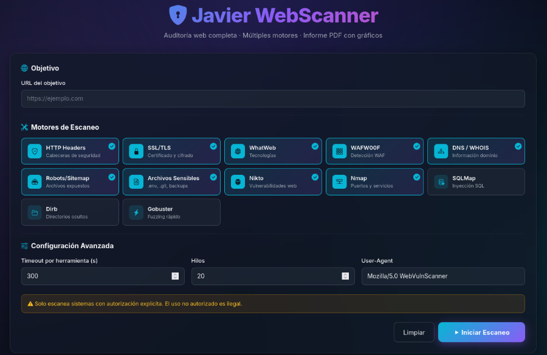

# Javier WebScanner

> Web vulnerability scanner con dashboard interactivo e informes PDF automáticos. Pensado para Kali Linux.

[](https://www.python.org/)
[](https://flask.palletsprojects.com/)
[](LICENSE)
[](https://www.kali.org/)

Dashboard web que orquesta 12 motores de auditoría (nikto, nmap, sqlmap, dirb, gobuster, whatweb, wafw00f, además de checks propios HTTP headers, SSL/TLS, DNS/WHOIS, robots.txt, archivos sensibles), agrega los hallazgos por severidad y genera un informe PDF con gráficos.

---

## Captura

### Dashboard

<!-- 
### Resultados

 -->
---

## Características

- **12 motores de escaneo** integrados, seleccionables por checkbox
- **Checks propios sin dependencias externas**:
  - Cabeceras de seguridad (HSTS, CSP, X-Frame-Options, X-Content-Type-Options, Referrer-Policy, Permissions-Policy)
  - SSL/TLS (protocolo, cifrado, expiración del certificado, chain `openssl s_client`)
  - DNS (A/AAAA/MX/TXT/NS/CNAME/SOA) + WHOIS
  - robots.txt, sitemap.xml, security.txt, humans.txt
  - Archivos sensibles expuestos (.env, .git/config, dumps SQL, backups, phpinfo, paneles admin)
- **Clasificación automática de hallazgos** en 4 niveles (crítica, media, baja, informativa)
- **Dashboard moderno** con glassmorphism, gráficos en vivo (Chart.js), barra de progreso animada
- **Informe PDF profesional** generado al terminar el escaneo con:
  - Resumen ejecutivo en tabla coloreada
  - Gráfico doughnut de distribución por severidad
  - Gráfico de barras de hallazgos por motor
  - Listado detallado por severidad
  - Salida cruda completa por herramienta
  - Recomendaciones generales
- **Bind local** (`127.0.0.1:5000`), validación estricta de URL, ejecución de subprocesos sin shell

---

## Stack

| Capa | Tecnología |
|------|-----------|
| Backend | Python 3.10+, Flask |
| HTTP / TLS | requests, urllib3, ssl, socket |
| PDF | reportlab |
| Gráficos servidor | matplotlib (Agg) |
| Frontend | Bootstrap 5.3, Bootstrap Icons, Chart.js 4 |
| Tipografía | Inter, JetBrains Mono |
| Herramientas externas | nikto, nmap, sqlmap, dirb, gobuster, whatweb, wafw00f, dig, whois, openssl |

---

## Instalación rápida (Kali Linux)

```bash
git clone https://github.com/<tu-usuario>/javier-webscanner.git
cd javier-webscanner
chmod +x install.sh start.sh
./install.sh
./start.sh
```

Abre [http://127.0.0.1:5000](http://127.0.0.1:5000).

`install.sh` se encarga de:

1. `apt install` de las herramientas pentesting + `python3-venv`, `dirbuster`, `wordlists`
2. Crear venv en `./venv/` (evita el error *externally-managed-environment* de Kali)
3. `pip install -r requirements.txt`

`start.sh` activa el venv y arranca Flask.

---

## Uso

1. Introduce la URL objetivo (`https://...`).
2. Selecciona los motores. Por defecto se activan los rápidos y no destructivos.
3. Ajusta timeout / hilos / User-Agent si quieres.
4. **Iniciar Escaneo**.
5. Revisa los hallazgos en vivo. Al terminar:
   - Aparece el botón **Descargar Informe PDF**
   - El PDF queda guardado en `reports/informe_<host>_<fecha>_<id>.pdf`

---

## Estructura del proyecto

```
javier-webscanner/
├── app.py                  # Flask backend + ScannerThread + PDF builder
├── install.sh              # Instalador Kali (apt + venv + pip)
├── start.sh                # Lanzador (activa venv + flask)
├── requirements.txt        # Dependencias Python
├── templates/
│   └── index.html          # Dashboard
├── static/
│   ├── css/                # (reservado para overrides)
│   └── js/                 # (reservado)
├── reports/                # PDFs generados (gitignored)
├── docs/
│   └── screenshots/        # Capturas para el README
├── .gitignore
├── LICENSE
└── README.md
```

---

## Motores disponibles

| ID | Motor | Tipo | Descripción |
|----|-------|------|-------------|
| `http_headers` | propio | passivo | Cabeceras de seguridad + cookies + fingerprinting |
| `ssl_check` | propio | passivo | TLS, cipher, certificado, openssl s_client |
| `whatweb` | externo | passivo | Identificación de tecnologías |
| `wafw00f` | externo | passivo | Detección de WAF |
| `dns` | externo | passivo | dig (varios records) + whois |
| `robots` | propio | passivo | robots.txt, sitemap.xml, security.txt, humans.txt |
| `sensitive_files` | propio | activo ligero | Prueba 24+ rutas comunes (.env, .git, dumps...) |
| `nikto` | externo | activo | Vulnerabilidades web conocidas |
| `nmap` | externo | activo | Puertos + servicios + scripts NSE |
| `sqlmap` | externo | activo | Inyección SQL (level 1, risk 1) |
| `dirb` | externo | activo | Fuzzing de directorios |
| `gobuster` | externo | activo | Fuzzing rápido |

---

## Configuración

Variables editables en `app.py`:

| Constante | Descripción |
|-----------|-------------|
| `ALLOWED_TOOLS` | Whitelist de motores ejecutables |
| `SECURITY_HEADERS` | Headers a comprobar y su severidad |
| `SENSITIVE_PATHS` | Lista de rutas a probar en `sensitive_files` |
| `WORDLIST_CANDIDATES` | Wordlists candidatas (auto-detect) para dirb/gobuster |

---

## Seguridad del propio scanner

- Bind a `127.0.0.1` solamente (no expuesto en LAN)
- `subprocess.run` con lista de argumentos, **sin `shell=True`**
- Validación estricta de URL con regex + `urlparse`
- Whitelist de motores, no se acepta input arbitrario
- Escapado HTML en el frontend (`textContent` para output crudo)
- Sin almacenamiento de credenciales

---

## Aviso legal

Esta herramienta solo debe usarse contra sistemas para los que tengas **autorización escrita explícita**. El escaneo no autorizado de infraestructura ajena es ilegal en la mayoría de jurisdicciones.

> El autor no se responsabiliza del mal uso de esta herramienta.

---

## Roadmap

- [ ] Persistencia de escaneos (SQLite)
- [ ] Comparación entre escaneos del mismo target (diff)
- [ ] Export JSON / SARIF
- [ ] Plantilla PDF personalizable
- [ ] Modo CLI
- [ ] Integración con Burp / ZAP

---

## Contribuir

PRs bienvenidas. Antes de abrir una:

1. Fork + branch desde `main`
2. Cambios en commits atómicos
3. Probar `install.sh` y `start.sh` en Kali limpio
4. Abrir PR con descripción clara

---

## Licencia

[MIT](LICENSE) © 2026 Javier Garrido
